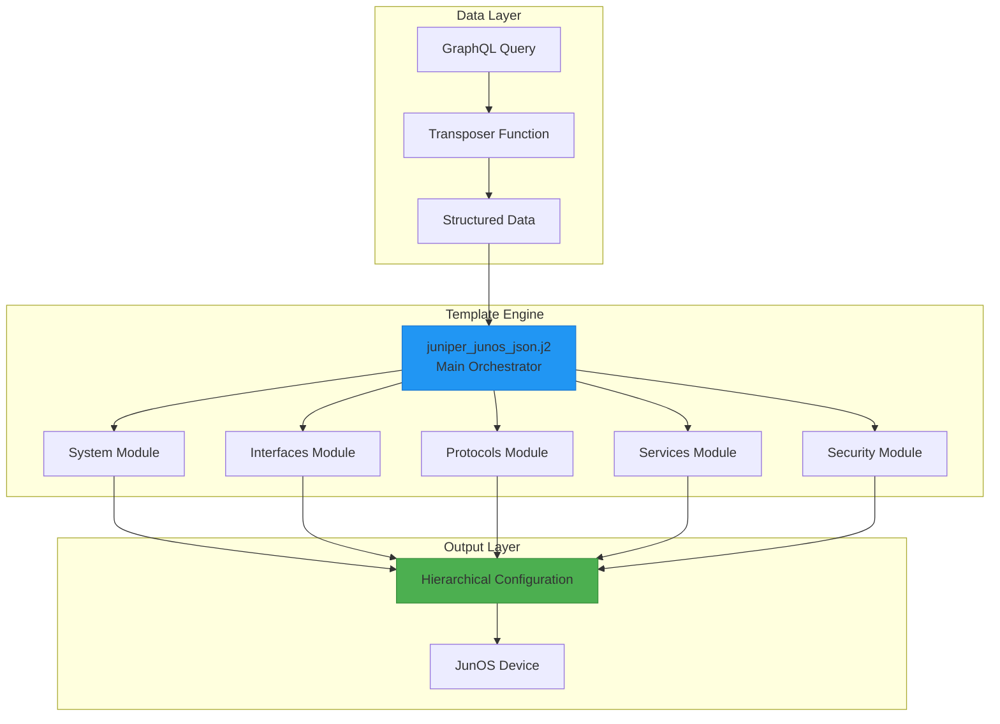
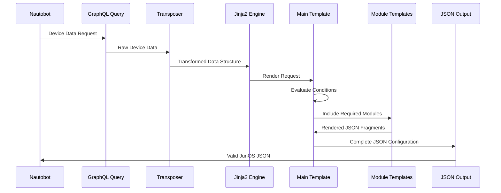
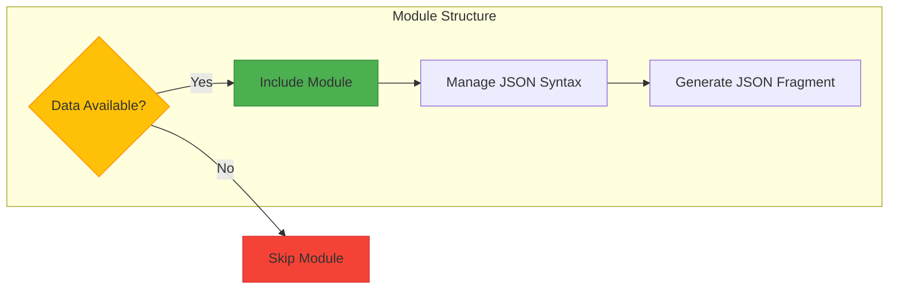
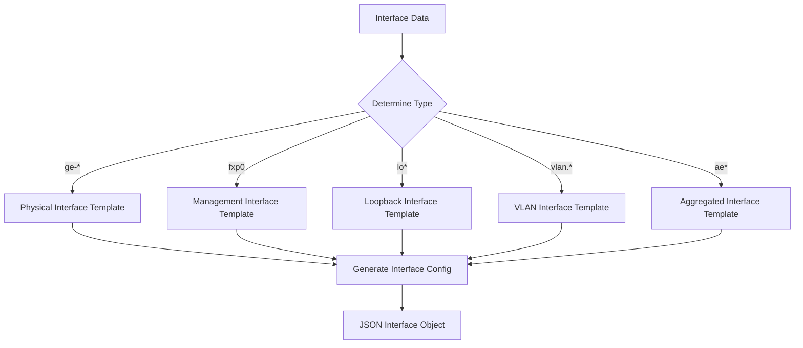
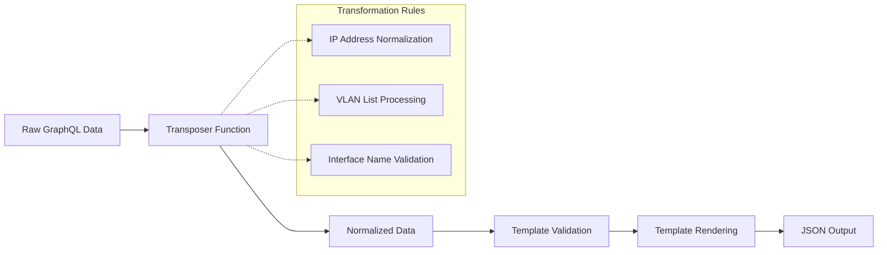
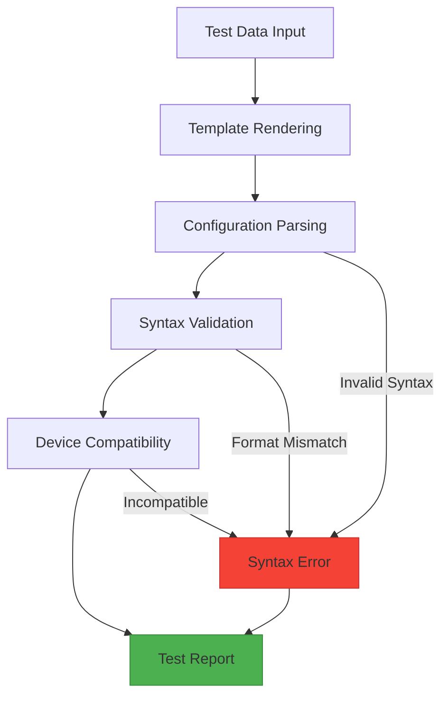

# Juniper JunOS Hierarchical Template System Design

## Overview

The Juniper JunOS Hierarchical Template System is a modular Jinja2-based template framework designed to generate structured hierarchical configurations for Juniper networking devices using the native JunOS configuration syntax with curly braces and nested structures. This system produces configurations that match the exact format used in JunOS configuration files.

**Core Design Objectives:**
- Generate hierarchical JunOS configuration output with curly brace syntax
- Maintain separation from existing flat CLI "set" command templates
- Implement modular architecture for extensibility and maintainability
- Leverage existing GraphQL data structure and transposer logic
- Enable structured configuration management using native JunOS format

**Key Features:**
- Modular template architecture with hierarchical organization
- Native JunOS configuration format with nested structure
- Conditional configuration inclusion based on device attributes
- Comprehensive coverage of system, interface, protocol, and security configurations
- Integration with Nautobot Golden Config plugin

## Architecture

### System Architecture Overview

The template system implements a **hierarchical modular architecture** where the main orchestration template (`juniper_junos_json.j2`) acts as a conductor that conditionally includes specialized configuration modules based on input data availability.



### Template Hierarchy Structure

The modular design organizes templates into a clear hierarchy with specialized responsibilities:

```mermaid
graph TD
    MAIN[juniper_junos_json.j2<br/>Main Template] --> SYS[_system.j2<br/>System Module]
    MAIN --> INT[_interfaces.j2<br/>Interfaces Module]
    MAIN --> PROT[_protocols.j2<br/>Protocols Module]
    MAIN --> SERV[_services.j2<br/>Services Module]
    MAIN --> SEC[_security.j2<br/>Security Module]
    
    SYS --> HOST[_hostname.j2]
    SYS --> DNS[_dns.j2]
    SYS --> NTP[_ntp.j2]
    SYS --> USERS[_users.j2]
    SYS --> SSH[_ssh.j2]
    SYS --> SYSLOG[_syslog.j2]
    
    INT --> PHYS[_physical_interface.j2]
    INT --> MGMT[_management_interface.j2]
    INT --> LOOP[_loopback_interface.j2]
    INT --> VLAN[_vlan_interface.j2]
    INT --> AGG[_aggregated_interface.j2]
    
    PROT --> BGP[_bgp.j2]
    PROT --> OSPF[_ospf.j2]
    PROT --> LLDP[_lldp.j2]
    PROT --> STATIC[_static_routes.j2]
    
    SERV --> SNMP[_snmp.j2]
    SERV --> DHCP[_dhcp.j2]
    SERV --> WEB[_web_management.j2]
    
    SEC --> FW[_firewall.j2]
    SEC --> ZONES[_zones.j2]
    SEC --> POL[_policies.j2]
    
    style MAIN fill:#FF9800,stroke:#F57C00
    style SYS fill:#2196F3,stroke:#1976D2
    style INT fill:#2196F3,stroke:#1976D2
    style PROT fill:#2196F3,stroke:#1976D2
    style SERV fill:#2196F3,stroke:#1976D2
    style SEC fill:#2196F3,stroke:#1976D2
```



### Data Flow Architecture

The system processes configuration data through a structured pipeline:



### Module Integration Pattern

Each configuration module follows a consistent integration pattern:



## Component Architecture

### Main Orchestration Template

**File:** `juniper_junos_json.j2`

The main template serves as the orchestration layer that:
- Creates the hierarchical configuration structure with version header
- Conditionally includes module templates based on data availability
- Manages proper JunOS syntax with curly braces and semicolons
- Ensures valid JunOS configuration format throughout the rendering process

**Core Responsibilities:**
- Version header generation
- Module inclusion logic
- JunOS syntax management
- Configuration section ordering

**Template Structure:**
```jinja2
version {{ config_context.version | default('24.2R1-S2.5') }};













```

### System Configuration Module

**File:** `junos_json/_system.j2`

Generates system-level configuration encompassing fundamental device settings.

**Component Templates:**
| Template | Purpose | Data Source |
|----------|---------|-------------|
| `_hostname.j2` | Device hostname configuration | `hostname` variable |
| `_dns.j2` | DNS client configuration | `config_context.dns` |
| `_ntp.j2` | NTP synchronization settings | `config_context.ntp` |
| `_users.j2` | User account management | `config_context.users` |
| `_ssh.j2` | SSH service configuration | Always included |
| `_syslog.j2` | System logging configuration | `config_context.syslog` |

**Configuration Output Structure:**
```junos
system {
    host-name device-hostname;
    root-authentication {
        encrypted-password "$6$hash...";
    }
    login {
        user admin {
            uid 2000;
            class super-user;
            authentication {
                encrypted-password "$6$hash...";
            }
        }
    }
    services {
        ssh;
    }
    syslog {
        file messages {
            any notice;
            authorization info;
        }
    }
}
```

### Interface Configuration Module

**File:** `junos_json/_interfaces.j2`

Handles all interface-related configurations with type-specific processing.

**Interface Types Support:**
| Interface Type | Template | Pattern | Description |
|----------------|----------|---------|-------------|
| Physical | `_physical_interface.j2` | `ge-*/*/*/*` | Gigabit Ethernet interfaces |
| Management | `_management_interface.j2` | `fxp0` | Out-of-band management |
| Loopback | `_loopback_interface.j2` | `lo0`, `lo*` | Loopback interfaces |
| VLAN | `_vlan_interface.j2` | `vlan.*` | VLAN interfaces |
| Aggregated | `_aggregated_interface.j2` | `ae*` | Link aggregation |

**Interface Configuration Logic:**


### Protocol Configuration Module

**File:** `junos_json/_protocols.j2`

Manages routing and network protocol configurations.

**Supported Protocols:**
| Protocol | Template | Trigger Condition | Configuration Scope |
|----------|----------|-------------------|---------------------|
| BGP | `_bgp.j2` | `config_context.bgp` | AS numbers, neighbors, policies |
| OSPF | `_ospf.j2` | `config_context.ospf` | Areas, interfaces, authentication |
| LLDP | `_lldp.j2` | `config_context.lldp` | Discovery settings, interfaces |
| Static Routes | `_static_routes.j2` | `config_context.static_routes` | Route entries, next-hops |

### Services Configuration Module

**File:** `junos_json/_services.j2`

Configures network services and management protocols.

**Service Categories:**
| Service | Template | Configuration Elements |
|---------|----------|----------------------|
| SNMP | `_snmp.j2` | Communities, access control, traps |
| DHCP | `_dhcp.j2` | Server configuration, pools, options |
| Web Management | `_web_management.j2` | HTTP/HTTPS access, authentication |

### Security Configuration Module

**File:** `junos_json/_security.j2`

Implements security policies and access control mechanisms.

**Security Components:**
| Component | Template | Purpose |
|-----------|----------|---------|
| Firewall | `_firewall.j2` | Traffic filtering rules |
| Security Zones | `_zones.j2` | Network segmentation |
| Security Policies | `_policies.j2` | Access control policies |

## Data Model Integration

### GraphQL Data Structure

The template system leverages the existing GraphQL query structure used by CLI templates:

**Primary Data Elements:**
```json
{
  "hostname": "string",
  "interfaces": [
    {
      "name": "string",
      "description": "string", 
      "enabled": "boolean",
      "ip_addresses": [{"address": "string"}],
      "type": "string"
    }
  ],
  "config_context": {
    "version": "string",
    "chassis": {...},
    "routing": {...},
    "protocols": {...},
    "services": {...}
  }
}
```

### Data Transformation Pipeline

The system processes data through the following transformation stages:



### Configuration Context Mapping

| CLI Template Context | Hierarchical Template Context | Transformation |
|---------------------|-------------------------------|----------------|
| `set system host-name` | `host-name value;` | Direct syntax |
| `set interfaces ge-0/0/0` | `ge-0/0/0 { ... }` | Nested structure |
| `set protocols bgp` | `protocols { bgp { ... } }` | Hierarchical nesting |

## Configuration Output Specification

### Hierarchical Structure Compliance

All generated configurations conform to native JunOS configuration format:

```junos
version 24.2R1-S2.5;
system {
    host-name vrouter92;
    root-authentication {
        encrypted-password "$6$hash...";
    }
    login {
        user admin {
            uid 2000;
            class super-user;
        }
    }
}
interfaces {
    ge-0/0/0 {
        unit 0 {
            family inet {
                address 10.0.0.15/24;
            }
        }
    }
}
```

### Syntax Validation

**JunOS Configuration Syntax Requirements:**
- Version statement at the beginning
- Proper curly brace nesting for hierarchical structure
- Semicolons terminating configuration statements
- Correct indentation for readability
- Valid JunOS configuration keywords and syntax

### Device Compatibility

The generated configuration is designed for direct loading by:
- JunOS devices via configuration mode
- NETCONF protocol sessions
- Configuration management tools
- Automated deployment systems

## Template Development Patterns

### Conditional Inclusion Pattern

All modules implement consistent conditional inclusion:

```jinja2



```

### JunOS Syntax Management

Proper hierarchical structure and statement termination:

```jinja2

block-name {
    
    {{ item.name }} {{ item.value }};
    
}

```

### Data Validation Pattern

Templates include data validation before rendering:

```jinja2

<!-- Render configuration -->

```

## Testing Strategy

### Template Validation Framework

**Validation Components:**
- JunOS configuration syntax validation
- Hierarchical structure compliance checking  
- Configuration statement verification
- Device compatibility testing

**Testing Script:** `validate_json_templates.py`

### Test Data Structure

```python
test_scenarios = {
    "basic_config": {
        "hostname": "test-device",
        "interfaces": [...],
        "expected_sections": ["system", "interfaces"]
    },
    "full_config": {
        "hostname": "full-device", 
        "interfaces": [...],
        "config_context": {...},
        "expected_sections": ["system", "interfaces", "protocols", "services"]
    }
}
```

### Validation Workflow

