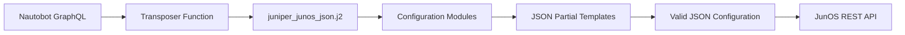

# Juniper JunOS JSON Template System Design

## Overview

This design document outlines the implementation of a new modular Jinja2 template system for generating JSON-style configurations for Juniper devices. The new template system will output configurations compatible with JunOS REST API specifications, enabling programmatic device configuration through JSON payloads.

The system builds upon the existing CLI template implementation (`juniper_junos.j2`) while introducing a completely separate modular architecture that generates JSON output instead of CLI commands. This ensures compatibility with modern JunOS REST API interactions while maintaining separation from the existing CLI-based templates.

### Key Requirements
- Generate valid JSON output compatible with JunOS REST API specifications
- Implement modular template architecture for maintainability and extensibility
- Support all configuration aspects currently handled by CLI templates
- Organize templates in separate `junos_json/` directory to avoid conflicts
- Maintain data compatibility with existing GraphQL query and transposer

## Architecture

### Template Hierarchy

The template system follows a hierarchical modular design where the main template orchestrates configuration generation by including specialized partial templates for each configuration domain.

```mermaid
graph TD
    A[juniper_junos_json.j2] --> B[System Module]
    A --> C[Interfaces Module]
    A --> D[Protocols Module]
    A --> E[Services Module]
    A --> F[Security Module]
    
    B --> B1[junos_json/_hostname.j2]
    B --> B2[junos_json/_dns.j2]
    B --> B3[junos_json/_ntp.j2]
    B --> B4[junos_json/_users.j2]
    
    C --> C1[junos_json/_physical_interface.j2]
    C --> C2[junos_json/_loopback_interface.j2]
    C --> C3[junos_json/_management_interface.j2]
    C --> C4[junos_json/_vlan_interface.j2]
    C --> C5[junos_json/_aggregated_interface.j2]
    
    D --> D1[junos_json/_bgp.j2]
    D --> D2[junos_json/_ospf.j2]
    D --> D3[junos_json/_lldp.j2]
    D --> D4[junos_json/_static_routes.j2]
    
    E --> E1[junos_json/_snmp.j2]
    E --> E2[junos_json/_syslog.j2]
    E --> E3[junos_json/_ssh.j2]
    E --> E4[junos_json/_dhcp.j2]
    E --> E5[junos_json/_web_management.j2]
    
    F --> F1[junos_json/_firewall.j2]
    F --> F2[junos_json/_zones.j2]
    F --> F3[junos_json/_policies.j2]
```



### JSON Configuration Structure

The generated JSON follows JunOS REST API configuration schema:

```json
{
  "configuration": {
    "system": {
      "host-name": "device-name",
      "services": {},
      "login": {},
      "ntp": {}
    },
    "interfaces": {
      "interface": []
    },
    "protocols": {
      "bgp": {},
      "ospf": {},
      "lldp": {}
    },
    "security": {
      "zones": {},
      "policies": {}
    }
  }
}
```

### Module Organization

Each configuration module is responsible for a specific aspect of device configuration:

| Module | Purpose | Partial Templates |
|--------|---------|-------------------|
| **System** | Basic system configuration | `_hostname.j2`, `_dns.j2`, `_ntp.j2`, `_users.j2` |
| **Interfaces** | Physical and logical interface configuration | `_physical_interface.j2`, `_loopback_interface.j2`, `_management_interface.j2`, `_vlan_interface.j2`, `_aggregated_interface.j2` |
| **Protocols** | Routing and network protocols | `_bgp.j2`, `_ospf.j2`, `_lldp.j2`, `_static_routes.j2` |
| **Services** | Network services and management | `_snmp.j2`, `_syslog.j2`, `_ssh.j2`, `_dhcp.j2`, `_web_management.j2` |
| **Security** | Firewall and security policies | `_firewall.j2`, `_zones.j2`, `_policies.j2` |

## Technology Stack & Dependencies

### Template Engine Integration
- **Jinja2**: Primary template engine for JSON generation
- **JSON Schema Validation**: Ensures output compliance with JunOS REST API
- **GraphQL Data Source**: Utilizes existing device data query structure

### Data Flow Architecture



### Template Rendering Process

1. **Data Retrieval**: GraphQL query fetches device configuration data
2. **Data Transformation**: Transposer function processes data for JSON template consumption
3. **Template Orchestration**: Main template includes appropriate configuration modules
4. **JSON Generation**: Partial templates generate JSON fragments for specific configuration areas
5. **Configuration Assembly**: Complete JSON configuration assembled and validated

## Component Architecture

### Main Template Structure

The main template (`juniper_junos_json.j2`) serves as the orchestration point:

```jinja2
{
  "configuration": {
    ,
    ,
    ,
    ,
    
  }
}
```

### System Configuration Module

Handles basic system settings and identity:

| Component | Template | JSON Output Structure |
|-----------|----------|----------------------|
| Hostname | `_hostname.j2` | `"host-name": "value"` |
| DNS Settings | `_dns.j2` | `"domain-name": "value", "name-server": []` |
| NTP Configuration | `_ntp.j2` | `"ntp": {"server": []}` |
| User Management | `_users.j2` | `"login": {"user": []}` |

### Interface Configuration Module

Manages all interface types and configurations:

| Interface Type | Template | Purpose |
|----------------|----------|---------|
| Physical | `_physical_interface.j2` | GigabitEthernet, FastEthernet interfaces |
| Loopback | `_loopback_interface.j2` | Loopback interface configuration |
| Management | `_management_interface.j2` | Management interface (fxp0) configuration |
| VLAN | `_vlan_interface.j2` | VLAN interface configuration |
| Aggregated | `_aggregated_interface.j2` | Link aggregation configuration |

### Protocols Configuration Module

Handles routing and network protocols:

| Protocol | Template | Configuration Scope |
|----------|----------|---------------------|
| BGP | `_bgp.j2` | Border Gateway Protocol |
| OSPF | `_ospf.j2` | Open Shortest Path First |
| LLDP | `_lldp.j2` | Link Layer Discovery Protocol |
| Static Routes | `_static_routes.j2` | Static routing configuration |

### Services Configuration Module

Manages network services and management protocols:

| Service | Template | Purpose |
|---------|----------|---------|
| SNMP | `_snmp.j2` | Simple Network Management Protocol |
| Syslog | `_syslog.j2` | System logging configuration |
| SSH | `_ssh.j2` | Secure Shell access |
| DHCP | `_dhcp.j2` | Dynamic Host Configuration Protocol |
| Web Management | `_web_management.j2` | HTTP/HTTPS management interface |

### Security Configuration Module

Handles firewall and security policy configuration:

| Security Component | Template | Purpose |
|-------------------|----------|---------|
| Firewall Rules | `_firewall.j2` | Packet filtering rules |
| Security Zones | `_zones.j2` | Network security zones |
| Security Policies | `_policies.j2` | Inter-zone security policies |

## Template Development Specifications

### JSON Template Standards

1. **Valid JSON Output**: All templates must generate syntactically correct JSON
2. **JunOS Schema Compliance**: JSON structure must conform to JunOS REST API specifications
3. **Conditional Logic**: Use Jinja2 conditionals to handle optional configuration elements
4. **Data Validation**: Include checks for required data before rendering configuration elements

### Template Naming Convention

- Main template: `juniper_junos_json.j2`
- Module templates: `junos_json/_module_name.j2`
- Partial templates: `junos_json/_specific_component.j2`

### JSON Structure Patterns

#### Configuration Block Template
```jinja2

"configuration-section": {
  
  "item-name": {
    "property": "{{ item.value }}"
  },
  
},

```

#### Interface Configuration Template
```jinja2
"interface": [
  
  {
    "name": "{{ interface.name }}",
    
    "description": "{{ interface.description }}",
    
    
    "unit": {
      "name": "0",
      "family": {
        "inet": {
          "address": [
            
            {
              "name": "{{ addr.address }}"
            },
            
          ]
        }
      }
    }
    
  },
  
]
```

### Data Access Patterns

Templates will access the same data structure used by CLI templates:

- `hostname`: Device hostname
- `interfaces`: List of interface configurations
- `config_context`: Device-specific configuration context
- `location.vlans`: VLAN information for the device location
- Platform-specific data through `platform` object

## Testing Strategy

### Template Validation Framework

1. **JSON Syntax Validation**: Ensure all generated output is valid JSON
2. **Schema Validation**: Verify compliance with JunOS REST API schema
3. **Data Completeness Testing**: Validate that all required configuration elements are present
4. **Conditional Logic Testing**: Test template behavior with various data scenarios

### Test Data Scenarios

| Test Scenario | Purpose |
|---------------|---------|
| Minimal Configuration | Test template with minimal required data |
| Full Configuration | Test template with all optional features enabled |
| Missing Data | Test template behavior when optional data is absent |
| Multiple Interfaces | Test interface iteration and JSON array generation |
| Protocol Combinations | Test multiple routing protocols enabled simultaneously |

### Validation Scripts

Create validation scripts to verify:
- JSON output syntax correctness
- JunOS schema compliance
- Configuration completeness
- Template rendering without errors

## Implementation Guidelines

### Development Phase Approach

1. **Phase 1**: Implement main template structure and system module
2. **Phase 2**: Develop interface configuration modules
3. **Phase 3**: Add protocol configuration modules
4. **Phase 4**: Implement services and security modules
5. **Phase 5**: Comprehensive testing and validation

### Template Development Best Practices

1. **Modular Design**: Keep each partial template focused on a single configuration aspect
2. **Error Handling**: Include appropriate error handling for missing or invalid data
3. **Documentation**: Document template variables and expected data structures
4. **Testing**: Test each template independently before integration
5. **Validation**: Validate JSON output against JunOS schema specifications

### Integration Considerations

- Templates must work with existing GraphQL query and transposer
- JSON output must be compatible with JunOS REST API
- Templates should handle the same data variations as CLI templates
- Configuration generation should be deterministic and repeatable